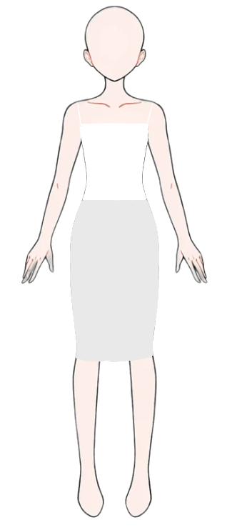

# Atelier — Dress-Up Studio 🪡

A sophisticated, kid-friendly dress-up game built with Next.js 16, TypeScript, and SVG/PNG layers. The model is **never shown naked** — a built-in modesty layer (white bandeau + gray pencil skirt) is always present.



## ✨ Features

- **Body model** = the original uploaded image (325 × 742, transparent background)
- **9 hairstyles** (hair2–hair10) — each manually aligned to sit on the head
- **7 tops** (top1–top7), **7 bottoms** (bottom1–bottom7), **4 dresses** (dress1, dress2, dress3, dress5)
- **6 backgrounds** (White, City Night, Balcony Room, Starry Room, Plant Corner, Flower Field)
- **Empty categories ready**: Coats, Shoes, Accessories, Decorations
- **Smart modesty logic** — the model is never naked; defaults restore automatically
- **Dress ↔ top/bottom switching** — choosing a dress clears top+bottom, choosing a top/bottom while wearing a dress restores the other default
- **Coat sleeve logic** — selecting a coat with a long-sleeve top/dress switches to the default short-sleeve top; with short sleeves, the coat layers in front
- **Interactive alignment tool** — press 🔧 Align ON in the header to nudge hair/dress positions with arrow keys
- **No page scroll** — the entire layout fits the viewport
- **No color picker** — each item shows in its original colors

## 🎨 Categories

| Category | Items | Notes |
|---|---|---|
| 🏛️ Background | 6 | White (default), City Night, Balcony Room, Starry Room, Plant Corner, Flower Field |
| 💇‍♀️ Hairstyle | 9 | All manually aligned to the head |
| 👚 Tops | 7 | top1–top7 (top8 Tie-Dye Cardigan removed) |
| 👖 Bottoms | 7 | bottom1 (Black Plaid) is the default; bottom8 (White Pleated) removed |
| 👗 Dresses | 4 | dress1, dress2, dress3, dress5 (dress4 Cream Floral removed) |
| 🧥 Coats | 0 | Empty — add your own. Renders at z=5.5 with sleeve logic |
| 👟 Shoes | 0 | Empty — add your own. Renders at z=8 |
| ✨ Accessories | 0 | Empty — add your own. Renders at z=7 |
| 🌷 Decorations | 0 | Empty — add your own. Renders at z=9 |

## 📐 Layer order (back → front)

```
z=0   background
z=1   hair back
z=2   body (with built-in modesty base)
z=3   bottom
z=4   top
z=5   dress
z=5.5 coat          ← NEW: above top/dress, below hair front
z=6   hair front
z=7   accessory
z=8   shoe          ← NEW
z=9   decoration    ← NEW
```

## 🛡️ Modesty defaults

- **Default top**: top4 (Cream Blouse, short sleeves)
- **Default bottom**: bottom1 (Black Plaid skirt)
- Choosing "None" for top or bottom → restores the default (never naked)
- Choosing a dress → clears top and bottom
- Choosing a top while wearing a dress → clears dress, restores default bottom
- Choosing a bottom while wearing a dress → clears dress, restores default top

## 📁 Project structure

```
public/
├── body.png              — original body image (transparent background)
├── bg-*.png              — 6 background images
├── hair*.png             — 9 hairstyle images
├── top*.png              — 7 top clothing images
├── bottom*.png           — 7 bottom clothing images
└── dress*.png            — 4 dress images

scripts/
├── remove_bg.py          — flood-fill script that removed the white background from body.png
├── find_dress_bbox.py    — finds the bounding box of non-transparent pixels in dress PNGs
└── push-to-github.sh     — helper script to push this project to your GitHub repo

src/
├── app/
│   ├── layout.tsx         — root layout & metadata
│   └── page.tsx           — renders <DressupGame/>
├── components/
│   └── dressup/
│       ├── DressupGame.tsx      — main page (fixed, no scroll)
│       ├── StageCanvas.tsx      — layered SVG canvas (520 × 760 viewBox)
│       ├── Sidebar.tsx          — right sidebar (categories + items + align panel)
│       ├── AlignmentPanel.tsx   — interactive alignment tool (arrow keys)
│       └── items/
│           ├── Body.tsx          — renders the original body image
│           ├── Hairs.tsx         — 9 hairstyles with alignment transforms
│           ├── Tops.tsx          — 7 tops with sleeveLength metadata
│           ├── Bottoms.tsx       — 7 bottoms (bottom7 has waist adjustment)
│           ├── Dresses.tsx       — 4 dresses with alignment transforms + sleeveLength
│           ├── Coats.tsx         — empty (ready for uploads)
│           ├── Shoes.tsx         — empty (ready for uploads)
│           ├── Accessories.tsx   — empty (ready for uploads)
│           ├── Decorations.tsx   — empty (ready for uploads)
│           └── Backgrounds.tsx   — 6 PNG backgrounds
└── lib/
    └── dressup/
        ├── items.ts              — central registry of categories & items
        ├── useDressup.ts         — game state (selections, alignments, coat logic)
        └── canvas-dimensions.ts  — canvas size, body scale, offset (single source of truth)
```

## 🚀 Run locally

```bash
bun install
bun run dev
# open http://localhost:3000
```

## 📤 Push to your GitHub

1. Create an **empty** repository on GitHub: https://github.com/new
   - Don't add a README, .gitignore, or license (we have them already)
2. Run the helper script:
   ```bash
   bash scripts/push-to-github.sh
   ```
3. Paste your GitHub repo URL when prompted
4. When asked for a password, use a [Personal Access Token](https://github.com/settings/tokens) (scope: `repo`), not your account password

## 🔄 Continue in a new session

To pick up where you left off in a new AI session:

1. Clone your GitHub repo:
   ```bash
   git clone https://github.com/YOUR-USERNAME/dress-up-game.git
   cd dress-up-game
   ```
2. Tell the new AI: *"I have a Next.js dress-up game project I just cloned. Continue working on it — I want to add coats/shoes/accessories."*

## 🔧 Adding more items

Each item is a React component that renders an SVG `<g>` using the shared `325 × 742` body viewBox. To add a new item:

1. Drop the PNG file in `/public/` (e.g. `coat1.png`)
2. Open the relevant file in `src/components/dressup/items/` (e.g. `Coats.tsx`)
3. Add a new component using the `makePngCoat('/coat1.png')` helper
4. Add it to the `COAT_ITEMS` array with an `id`, `name`, and `Component`
5. For coats, also set `sleeveLength: 'long'` or `'short'`

To align a new item, turn on **🔧 Align Mode** in the header, select the item, use arrow keys to nudge it, then click "Copy Values" and paste the values into the code.

## 🎨 Canvas dimensions

All dimensions live in `src/lib/dressup/canvas-dimensions.ts`:

```typescript
export const CANVAS_WIDTH = 520
export const CANVAS_HEIGHT = 760
export const BODY_SCALE = 0.88
// Body is anchored to the bottom (feet on ground)
// with ~99px of space above the head for hair/hats
```

Change these values to resize the canvas or body.

## 📜 License

This project is yours to use, modify, and share. Have fun! 🎉
